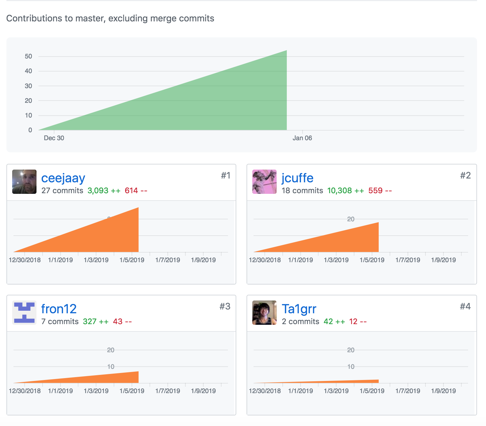

##Part 1 - Individual Accomplishments this Week

####Team's github contribution graph

####[My Github](https://github.com/Ta1grr)

###The work, challenges I've faced, the tools I used, and my accomplishment.

_The work you contribute?_

The work I've done this week was setting up a landing page component with bareminimum structure, created a billing subscription component (bare minimum as well), and implement a structured layout in the app component which indirectly created the app data flow between each components and finally wrote in the auth.js to associate a user from the database with a freshly authenticated user. 

_Challenges you've faced?_

The biggest challenge was trying to get back into programming again, luckily I was able to contribute by setting up our project logically and able to explain to the rest of the members why we should or should not do certain things. Another factor was getting the entire team input, luckily Chad and Jared are more extrovert than Fred and Richard, but it's totally understandable since it is the first week of Lambda Labs. 

_Tools you've used?_

The tools I've used so far is ReactJS, NodeJS and Express. I'm hoping to implement design to our frontend with bootstrap so it can be visually appealing, but we wanted to meet the weekly requirement first. 

_Accomplishment?_

My accomplishment for this week is driving the first day of the Technical Design Document (TDD),choosing the technology(with inputs from other teammates), and getting fred to said more than 1 word.

###Tasks Pulled

_This is the tasks I've pulled this week, with Github and Trello links provided (successfully merged PR completing the task accordingly.) There is at least one front end and one back end and met the minimum of 4 pull request per week._

####Front End
**Ticket 1** :
_Create a landing page component._

[Github](https://github.com/Lambda-School-Labs/dont-send-that-email/pull/6) / [Trello](https://trello.com/c/qMJmQGP8/25-create-landing-page-component)

**Ticket 2** :
_Create billing subscription component._

[Github](https://github.com/Lambda-School-Labs/dont-send-that-email/pull/15) / [Trello](https://trello.com/c/A0P1Nqlg/22-create-billing-subscription-component)

**Ticket 3** :
_Implement structured layout in the app component._

[Github](#) / [Trello](https://trello.com/c/OAcVpBTX/24-implement-structured-layout-in-the-app-component)

####Back End
**Ticket 1** :
_Associate a user from the database with a freshly authenticated user._

[Github](https://github.com/Lambda-School-Labs/dont-send-that-email/pull/22) / [Trello](https://trello.com/c/mpGVBHAr/34-associate-a-user-from-the-db-with-a-freshly-authenticated-user)

###Detailed Analysis

_Pick one of your tickets and provide a detailed analysis of the work you did.  This should be approximately ¼ page of text, and at least three screenshots._
####Associate a user from the database with a freshly authenticated user

This task was exceptionally challenging for me, whenever I face a new technology I haven't use before, I freeze up and work cautiously. Also, I knew I had forgotten some of syntax due to the three week long break, I was purposely avoiding my computer just to reset my brain. When I start tackling this task I started to look through the server folder and tried to understand the backend workflow but it took longer than 20 minutes. So I reached out in our channel for help and luckily Jared replied to help me out.

He first explain the backend workflow and then helped me understand how OAuth does it job for us. Then we immediately jump into writing code to get the task accomplished. It took us a bit to get it working due to adding new columns with knex migration because we wanted to uniquely identify each users by their email address. The problem was knex won't allow us to set the column to be .notNullable if the table already exist. So we ultimately agree to remove it because OAuth require an email to signup or login.

We were able to write the proper callback to check if the user logging in exist in the database, if they do exist then they can proceed to the application or else redirect them to the sign-up page.

**The code Jared and I wrote together to add new emailaddress column in the database.**

**The code Jared and I wrote together to add/check users in the database.**

**Object return after signing up or logging in(if they exist in the database)**

##Part 2 - Milestone Reflections

_As a part of your journal entry, write ¼ to ½ a page reflecting on your experiences forming a team. What did you do to help the team solidify as a group? What did you do that you now realize caused friction in this process?_

_Reflecting on your experiences forming a team_

This first week was definitely hectic, I get to meet my fellow team members: Jared, Fred, Chad and Richard. Day 1, we get to plan everything out, choosing our technology, how we design the frontend and discuss about the backend schema (user data model). I think the problematic portion was setting a position of leadership.

_What did you do to help the team solidify as a group?_

I tried to nominate Jared as the group leader because he display strong knowledge on majority of technology we have agreed on and able to help in both front or backend if needed. Although I do bombard him with questions in our decision making, I hope it would allow other team members to chime in and give their opinion or knowledge.

_What did you do that you now realize caused friction in this process?_

Probably from our strong display of extrovertedness cause a couple of members to take the backseat and just follow along. Which sometime cause a lack of commnication amongst our team, luckily Chad step in and check on other members.

[Team Journal link for this week](https://learn.lambdaschool.com/labs/sprint/recuhb6drriiyidwr)
