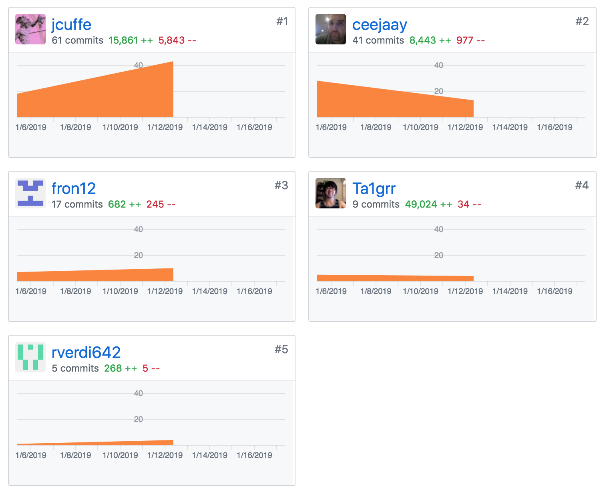
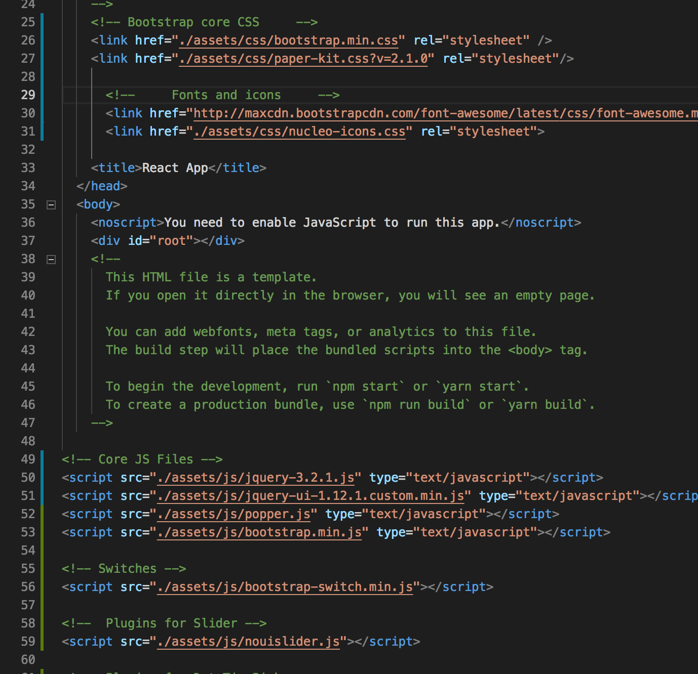
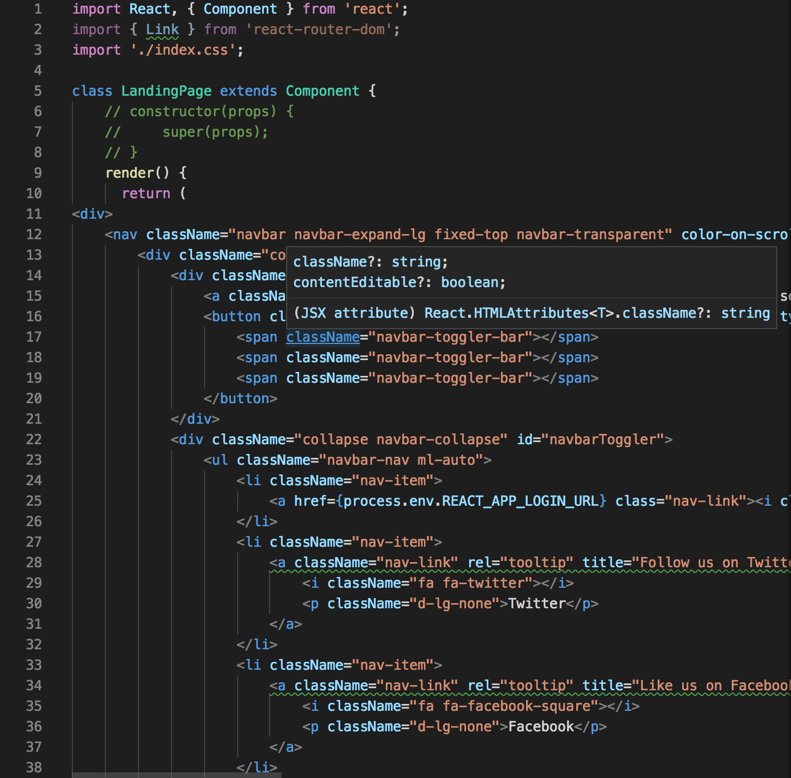

##Part 1 - Individual Accomplishments this Week

####Team's github contribution graph

####[White Board Interview Practice (week 2)](https://youtu.be/KjjIowizVMg)

####[My Github](https://github.com/Ta1grr)

###The work, challenges I've faced, the tools I used, and my accomplishment.

_The work you contribute?_

Mostly contributed pair programming early in the week due to moving. I helped Chad implement Watson API into the backend, Also paired program with Richard implementing Stripe API to the backend and frontend. Designed the Landing Page with everyone's opinion on color scheme, styles, etc.

_Challenges you've faced?_

Mostly was trying to get a communication going on who's doing what this week. We might need to create cards first in trello board next week to dictate what is needed to be done. Also trying to meet the pull request requirement and contribute to the group while moving. It was definitely a challenging week.

_Tools you've used?_

Since most of us aren't design-esque developers, I took the initiative to find a good template to overall set the application style tone. Mostly using Bootstrap to get the styling done without spending too much time, Watson API documentation is amazing, so it wasn't that difficult setting it up. Lastly the Stripe API is intimidating, it can cover almost everything you want, subscriptions, creating customer information, handling charges, etc. It's pretty amazing if fully utilized in any applications.

_Accomplishment?_

Getting our application coming together within 2 weeks has been fulfilling experience. Getting our landing page to look really good has been my accomplishment for this week, Josh's UI/UX lecture really set a good point on needing a landing page that'll draw in customers and set a solid first impression. Pair programming with great and talented team members really solidify our group and allow us to communicate more freely than before.

###Tasks Pulled

_This is the tasks I've pulled this week, with Github and Trello links provided (successfully merged PR completing the task accordingly.) There is at least one front end and one back end and met the minimum of 4 pull request per week._

####Front End
**Ticket 1** :
_Created a design template of the landing page in HTML._

[Github](https://github.com/Lambda-School-Labs/dont-send-that-email/pull/40) / [Trello](https://trello.com/c/Q2fn2caG/61-template-design-for-landing-pagehtml-and-rest-of-application)

**Ticket 2** :
_Finishing up Stripe on frontend to communicate with backend._

[Github](https://github.com/Lambda-School-Labs/dont-send-that-email/pull/45) / [Trello](https://trello.com/c/FvF0bzBC/55-stripe-front-and-backend-for-dste)

**Ticket 3** :
_Converted the HTML Landing Page to ReactJS_

[Github](https://github.com/Lambda-School-Labs/dont-send-that-email/pull/54) / [Trello](https://trello.com/c/byDDmoEz/62-converting-landing-page-to-reactjs-component)

**Ticket 4** :
_Hopefully font and navbar transition will work properly in netlify_

[Github](https://github.com/Lambda-School-Labs/dont-send-that-email/pull/57) / [Trello](#)

####Back End
**Ticket 1** :
<!-- _None_

[Github](#) / [Trello](#) -->

###Detailed Analysis

_Pick one of your tickets and provide a detailed analysis of the work you did.  This should be approximately ¼ page of text, and at least three screenshots._
####Converting the HTML landing page into ReactJS component.

It was intimidating at first, but with a few google-fu, adding in the bootstrap requirements (jquery, bootstrap.css, paper-kit.css, etc.) was a breeze. I did learn that it is bad practice due to Render Blocking CSS, in which next week I'll refactor the code base for performance improvement.

I did have to go through and convert all the html "class" to "className" and add a forward slash to the img tags so JSX will accept it.

Overall, I still need to add in a way for google fonts to ReactJS, ensure the styling from paper-kit css persist with rest of the components, and performance speed up to par.

**Landing Page on Netlify.**

**The code Jared and I wrote together to add/check users in the database.**

**Object return after signing up or logging in(if they exist in the database)**

##Part 2 - Milestone Reflections

_As a part of your journal entry, write ¼ to ½ a page reflecting on your experiences working with a team to integrate several servers, pages, APIs, and services into one project. Describe how your pieces of the project interfaced with and integrated with your teammates._

_Reflecting on your experiences working with a team_

I definitely need to improve working with my teammates, deciding our essential objective goal for this week and delegating work between members. I feel it's essential to communicate and decide as a whole on several deciding factors like backend flow/logic, the style theme of our project, which aspect of the API we're implementing.

_Integrating several servers, pages, APIs, and services into one project?_

Watson API was lessing intimidating to implement once we got a good idea how we decide to meet this week objective. We just want it to return a proper response so we can add it into our frontend to show we got the API working. Auth0 was fully implemented since last week all thanks to Jared effort. And lastly Stripe API was fun to work with especially from the backend and frontend, we used stripe-react-checkout for our frontend because it had the stripe style and modal which will compliment the application overall. The backend was interesting because we had to use cors dynamically and set a Whitelist to allow certain incoming URL.

_Describe how your pieces of the project interfaced with and integrated with your teammates?_

The Stripe API was paired program with Richard so it was straight forward on connecting the frontend with the backend.

The same goes for Watson API, we could test the endpoint with Postman and not worried about the Cors restriction.

[Team Journal link for this week](https://learn.lambdaschool.com/labs/sprint/recumtvkqrfgmx228)
