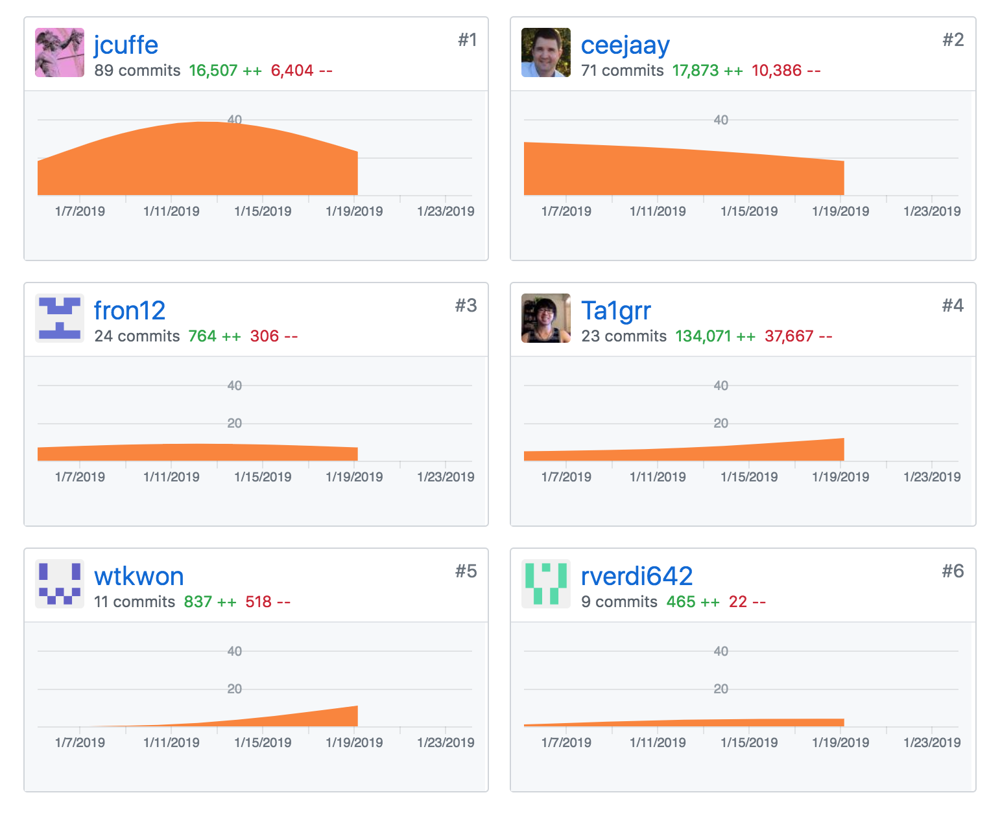
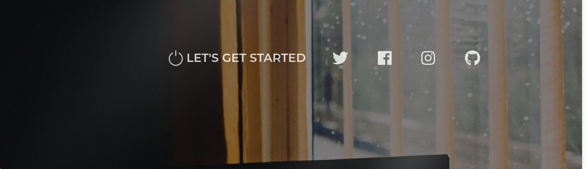
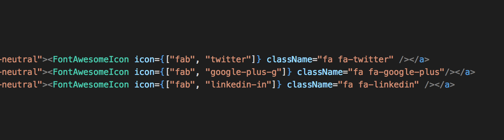
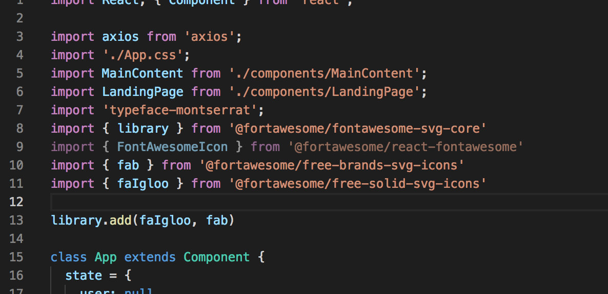

##Part 1 - Individual Accomplishments this Week

####Team's github contribution graph

####[White Board Interview Practice (week 3)](https://youtu.be/4GnB9bsl5bs)

####[My Github](https://github.com/Ta1grr)

###The work, challenges I've faced, the tools I used, and my accomplishment.

_The work you contribute?_

This week main focus was about responsiveness and feature functionality, I mainly invest my time in for the responsiveness and design of our application. For the backend, I moved the Watson API endpoint into the routers folder and for the frontend I added in countless improvements such as implementing fontawesome to reactjs, redesign billing component, help our new member get up to speed and understand our design flow/decisions.

_Challenges you've faced?_

The three day weekend was a bonus but also a curse, it definitely increase stress to ensure we accomplish our MVP (Minimum Viable Product) for this week. We had to make sure all the features and responsiveness met Lambda's standards and ensure that we covered all over user functionality as well that was not covered in the wired frame.

_Tools you've used?_

The group as a whole decide to convert the entire project to Reactstrap and just let our CSS library (Paper Kit 2 from Tim Creative) override the bootstrap CSS. Joshua was impressed by the design and commented that they probably should incorporate some form of design library as a mandatory thing for future lab students.

_Accomplishment?_

Meeting this week MVP was an accomplishment itself, especially when we had to add in features to meet the wire frame standards. Also getting our newest member comfortable in our group and up to speed is another accomplishment as well. Overall, I'm feeling good about our product and how well we colloborate together to complete this week objective.

###Tasks Pulled

_This is the tasks I've pulled this week, with Github and Trello links provided (successfully merged PR completing the task accordingly.) There is at least one front end and one back end and met the minimum of 4 pull request per week._

####Front End
**Ticket 1** :
_Redesign billing component_

[Github](https://github.com/Lambda-School-Labs/dont-send-that-email/pull/69) / [Trello](https://trello.com/c/sZuBwLgU/63-responsive-billing-component-mobile)

**Ticket 2** :
_Add font awesome to package.json so it'll display in netlify_

[Github](https://github.com/Lambda-School-Labs/dont-send-that-email/pull/96) / [Trello](https://trello.com/c/Ft3vwi4y/103-add-fontawesome-to-dependency-and-convert-i-tags-to-fontawesome-components)

**Ticket 3** :
_Fixing Fontawesome_

[Github](https://github.com/Lambda-School-Labs/dont-send-that-email/pull/101) / [Trello](https://trello.com/c/WbCbYtv3/95-fixing-font-awesome)

####Back End
**Ticket 1** :
_Moved watson endpoint to routers folder_

[Github](https://github.com/Lambda-School-Labs/dont-send-that-email/pull/70) / [Trello](https://trello.com/c/MeTzefxJ/80-move-watson-endpoint-to-routers-folder)

###Detailed Analysis

_Pick one of your tickets and provide a detailed analysis of the work you did.  This should be approximately ¼ page of text, and at least three screenshots._
####Adding Fontawesome.

One thing I've learn about Fontawesome, it is waaay easier to do it on HTML/CSS static webpages because you can just copy and paste the code you need to implement the icon. 

Implementing it with Reactjs, you need to import the correct library to use the icon you want, so if you want a Facebook icon, you have to call in the "Brands" library and if you want an igloo then you'll need the "Solid" library. Also depending on which library you're trying to implement will determine the style of syntax you can call it into your component. 

My recommendation is to read the documentation from its github pages as it will give you more details than fontawesome help section and save you a huge headache.

**FontAwesome Icons on the LandingPage Navbar**

**FontAwesome component being implemented.**

**Importing FontAwesome Library inside of App.js**

##Part 2 - Milestone Reflections

_Reflect on your experiences working with a team to convert a disparate set of components into a single, cohesive, and complete product._

It was interesting to watch how each of us tackle individual components and how it comes together as one whole application. Communication played a huge part, I held an initial meeting early in the week to get a clear understanding amongst all of us on what needs to be done and create a goal to achieve it. 

At first, it was hard to find a task to complete, but once we start working it became clear that we had a lot of things left to be completed. I'm glad we got an extra member in our group to fill in the roll for backend since Chad was sick majority of last week and had to do something else half of this week. 

Will is a great addition to our team and a great person to brainstorm initial logic/would-be cases.

_Describe the challenges you faced and the steps you took to overcome them._

Most of the challenge we faced was in the Create Email component because it held the heart of our application. To analyze and provide the user useful feedback of their text/email/documents, we needed to ensure the Watson API response work properly via providing color scheme to corresponding emotions or percentage to ensure valuable feedback. 

We were able to overcome several issues such as the "score" Watson provide after analyzing, it only return an emotion that score higher than 0.5 out of a 1. So the emotion can range between 0-1 within the thousandth but we needed to convert the score into a percentage value out of a hundred. 

Luckily Chad was able to solve that issue and got us going in the right direction.

[Team Journal link for this week](https://learn.lambdaschool.com/labs/sprint/rec33mgvnhczfvywa)
