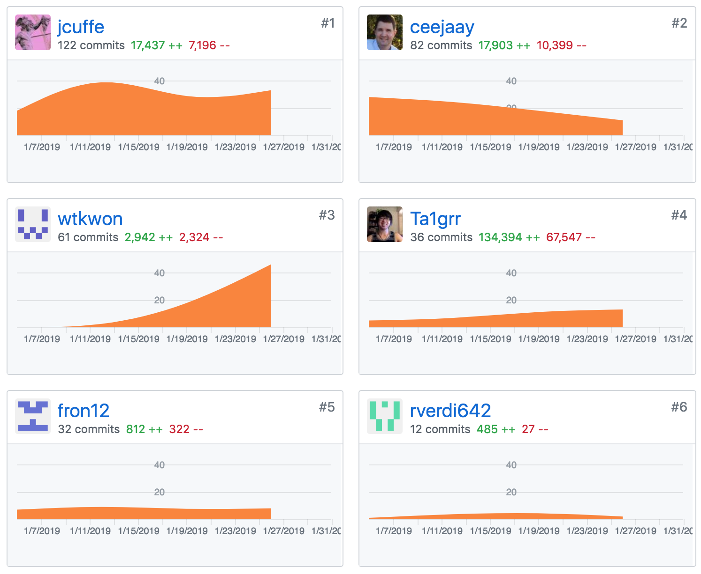
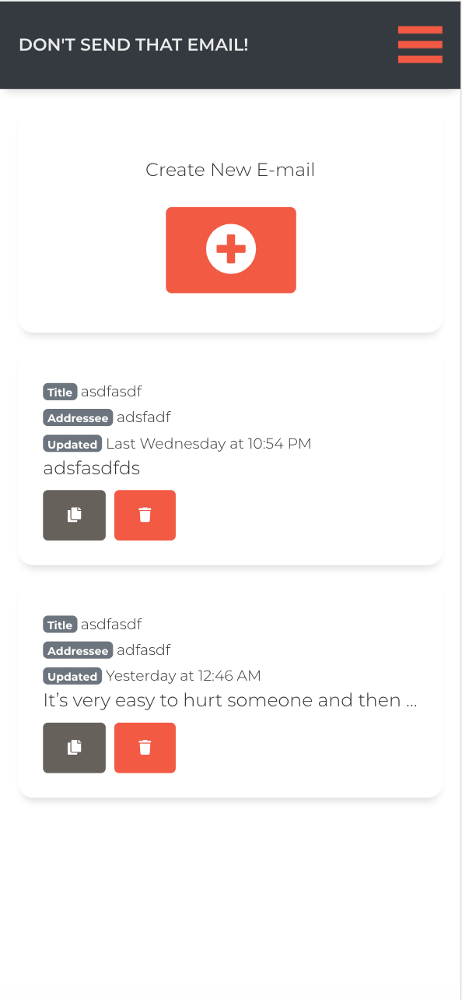
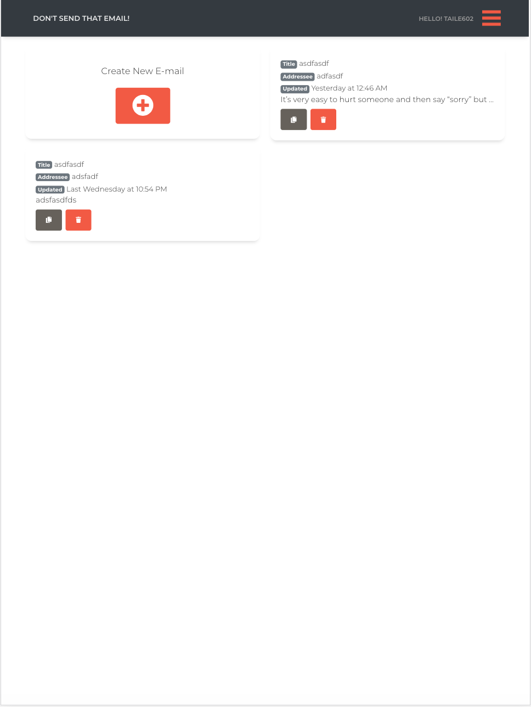
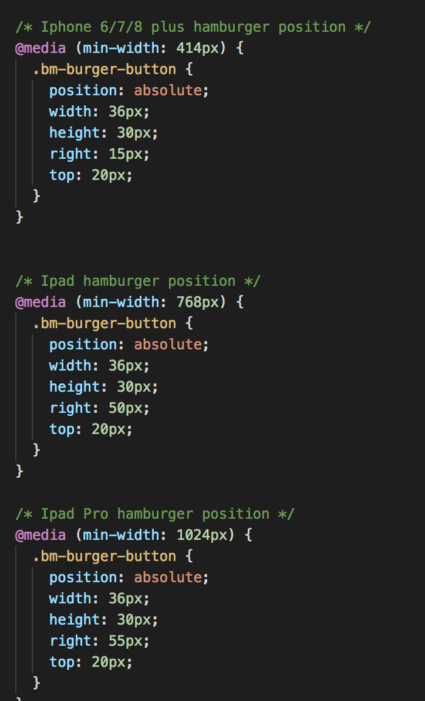

##Part 1 - Individual Accomplishments this Week

####Team's github contribution graph

####[White Board Interview Practice (week 4)](https://youtu.be/a5eW5BfvRr8)

####[My Github](https://github.com/Ta1grr)

###The work, challenges I've faced, the tools I used, and my accomplishment.

_The work you contribute?_

The work I have contributed this week was focusing on mobile responsiveness and revising the landing page to look more professional.

_Challenges you've faced?_

The biggest challenge was dealing with React-Hamburger-Nav, mainly because by default it has fix-position: absolute. Which mean React-Hamburger-Nav is a strong / single library that will follow it's own CSS and no other CSS will tell it what to do. Also, Brian/Joshua decided to change up this week by having each team check-in every monday with a proper plan to meet minimum MVP.

_Tools you've used?_

Lots and lots of Chrome webdev tool, messing around with CSS and checking mobile responsive view.

_Accomplishment?_

It felt great when Bri (our UI/UX instructor) gave us nit picking suggestions, which mean our product looks great and don't need any huge overhaul.

###Tasks Pulled

_This is the tasks I've pulled this week, with Github and Trello links provided (successfully merged PR completing the task accordingly.) There is at least one front end and one back end and met the minimum of 4 pull request per week._

####Front End
**Ticket 1** :
_Fixing layouts_

[Github](https://github.com/Lambda-School-Labs/dont-send-that-email/pull/124) / [Trello](https://trello.com/c/SkfQ9DjA/159-set-each-components-inside-a-container)

**Ticket 2** :
_Greet user inside Navbar_

[Github](https://github.com/Lambda-School-Labs/dont-send-that-email/pull/126) / [Trello](https://trello.com/c/T74WTAAI/113-place-greeting-in-navbar-breadcrumb-hamburger)

**Ticket 3** :
_Create Button centered just like in the wiredframe_

[Github](https://github.com/Lambda-School-Labs/dont-send-that-email/pull/130) / [Trello](https://trello.com/c/Y1uO2fLV/160-centered-create-email-button-just-like-in-the-wired-frame)

**Ticket 4** :
_Fixing more mobile view and CSS stuff_

[Github](https://github.com/Lambda-School-Labs/dont-send-that-email/pull/138) / [Trello](https://trello.com/c/42HKySIW/131-create-email-button-looks-hella-weird-in-mobile-document-list-no-emails)

<!-- ####Back End
**Ticket 1** :
_Moved watson endpoint to routers folder_

[Github](https://github.com/Lambda-School-Labs/dont-send-that-email/pull/70) / [Trello](https://trello.com/c/MeTzefxJ/80-move-watson-endpoint-to-routers-folder) -->

###Detailed Analysis

_Pick one of your tickets and provide a detailed analysis of the work you did.  This should be approximately ¼ page of text, and at least three screenshots._
####Fixing more mobile view and CSS stuff

This week wasn't as stressful as the previous week because we had an idea what the application will look like and apply the changes needed. Mobile view wasn't as bad since Reactstrap did most of the prototyping and responsiveness for us. But we still need to apply CSS to tweak things and make the product more refined.

**Iphone X View**

**Ipad Pro View**

**Hamburger breakpoints CSS**

##Part 2 - Milestone Reflections

_Reflect on your experiences working with a team to make your product look and feel as good as it works under the hood._

We had an unspoken understanding on how we want the application to look like, so we kept at it like we always do and just tackle one thing at a time individually.

_Describe how the duties of you and your team shifted tasks shifted towards the front end - and debugging the back end to improve UX._

We just nitpick at the application and decide what can be improved and create trello cards as we go.

[Team Journal link for this week](https://learn.lambdaschool.com/labs/sprint/rechzyzdlgmxi9apr)
