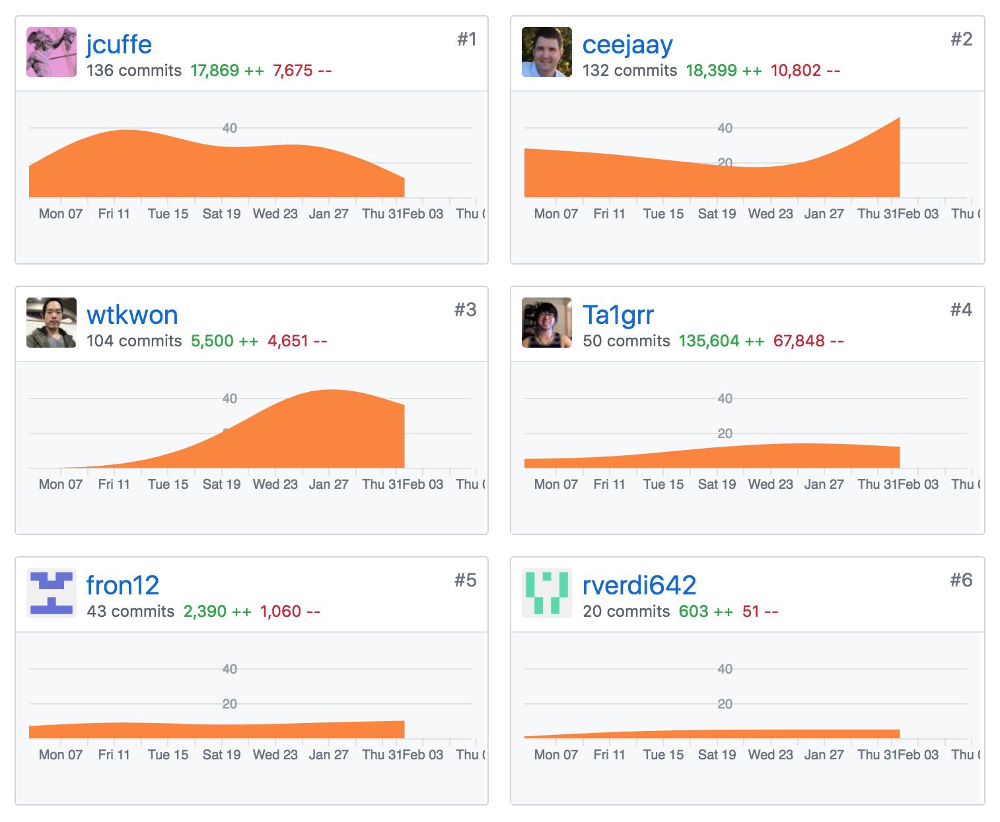
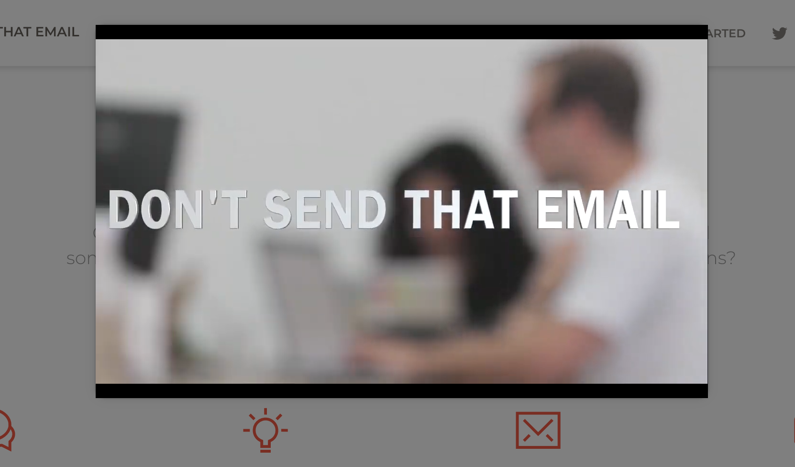
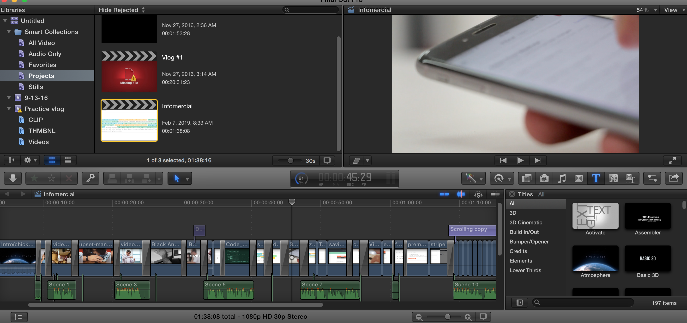
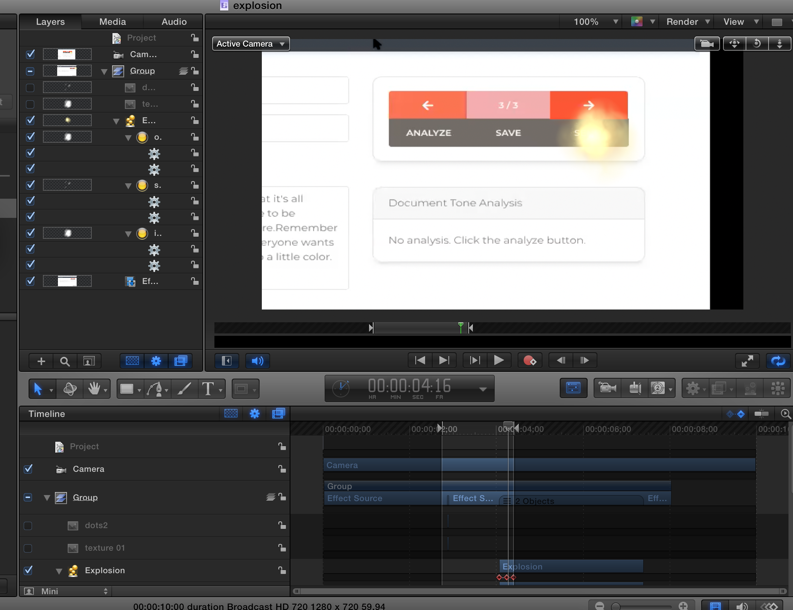

##Part 1 - Individual Accomplishments this Week

####Team's github contribution graph

<!-- ####[White Board Interview Practice (week 5)]() -->

####[My Github](https://github.com/Ta1grr)

###The work, challenges I've faced, the tools I used, and my accomplishment.

_The work you contribute?_

This week was a lot of finishing touch of our application, I went through and double check CSS to ensure no conflicts and volunteered to do video editing.

_Challenges you've faced?_

Challenges this week was mostly the clash of CSS, since we're using Reactstrap/bootstrap syntaxes to style our website. We could override each of our style by using the global bootstrap syntax without realizing.

_Tools you've used?_

Several tools were used this week - Final Cut Pro for video editing, Apple Motion for special effects, several websites for royal free stock videos, react-youtube for youtube videos, Reactstrap modals, and Apple compressor to format the video while keeping the quality for YouTube.

_Accomplishment?_

This project month was definitely a huge learning experience, it really boost confidence in my coding ability, working in a group and editing a video to showcase our hardwork.

###Tasks Pulled

_This is the tasks I've pulled this week, with Github and Trello links provided (successfully merged PR completing the task accordingly.) There is at least one front end and one back end and met the minimum of 4 pull request per week._

####Front End
**Ticket 1** :
_Added in icons and placeholder in create email component_

[Github](https://github.com/Lambda-School-Labs/dont-send-that-email/pull/172) / [Trello](https://trello.com/c/Cwz9ZEIx/146-tweaking-create-email-component-layout-to-be-more-ui-ux)

**Ticket 2** :
_Landing Page Card Profile border fix._

[Github](https://github.com/Lambda-School-Labs/dont-send-that-email/pull/196) / [Trello](https://trello.com/c/67FudQMw/205-landing-page-card-profile-css-fix)

**Ticket 3** :
_Editing infomercial_

[YouTube](https://youtu.be/C8qXvfXvkPs) / [Trello](https://trello.com/c/gn4p5Lpy/192-editing-infomercials)

**Ticket 4** :
_Fixed several CSS clash and add in Modal for infomercials_

[Github](https://github.com/Lambda-School-Labs/dont-send-that-email/pull/203) / [Trello](https://trello.com/c/8tllgFIn/206-adding-modal-for-infomercial-to-landing-page)

<!-- ####Back End
**Ticket 1** :
_Moved watson endpoint to routers folder_

[Github](https://github.com/Lambda-School-Labs/dont-send-that-email/pull/70) / [Trello](https://trello.com/c/MeTzefxJ/80-move-watson-endpoint-to-routers-folder) -->

###Detailed Analysis

_Pick one of your tickets and provide a detailed analysis of the work you did.  This should be approximately ¼ page of text, and at least three screenshots._
####Editing infomercial

The infomercial came together surprisingly easy, what was originally a small joke turn into a reality. Going for a infomercial style helped us out on formatting and a solid vision what we want to have in it. Choosing music wasn't difficult as well since youtube provide a huge library of royalty free music. The initial scream sound effect was used from a royalty free website and everything else from youtube sound effect library. Overall I feel confident about our video and probably add a bit more polish if time permit.

**Landing Page Modal View**

**Final Cut Pro Editing**

**Apple Motion Editing**

##Part 2 - Milestone Reflections

As a part of your journal entry, write ¼ to ½ a page reflecting on your experiences working with a team to bring an application to completion. The 90-90 rule is a quip referencing the very real difficulty of truly completing a project. Describe some of the final tasks that were the most difficult for your team to resolve - challenging bugs, layout and presentation woes, or anything else that was easy to get mostly working, but hard to get perfect

_Reflecting on your experiences working with a team to bring an application to completion._

Definitely a fun and stressful month long journey, I've learn communication is a huge issue when we have people working from different timezone but we got it working. Our PM calls it Chaos but we call it Serenity, as we just chug away and code what needed to be done.

_The 90-90 rule is a quip referencing the very real difficulty of truly completing a project._

Didn't really applied to us since we decide a concise clear goal to achieve our weekly MVP.

_Describe some of the final tasks that were the most difficult for your team to resolve - challenging bugs, layout and presentation woes, or anything else that was easy to get mostly working, but hard to get perfect_

The final touches and last minute stretch goals were stressful but we each knew what we wanted to get done and the time limit set for us. The biggest difficulty was to give a define goal to Joshua so he can approve it, but it eventually work itself out.

[Team Journal link for this week](https://learn.lambdaschool.com/labs/sprint/rec0dfyfdbfpwzclr)
